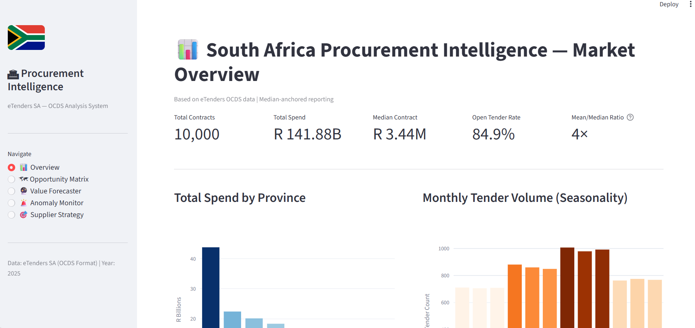
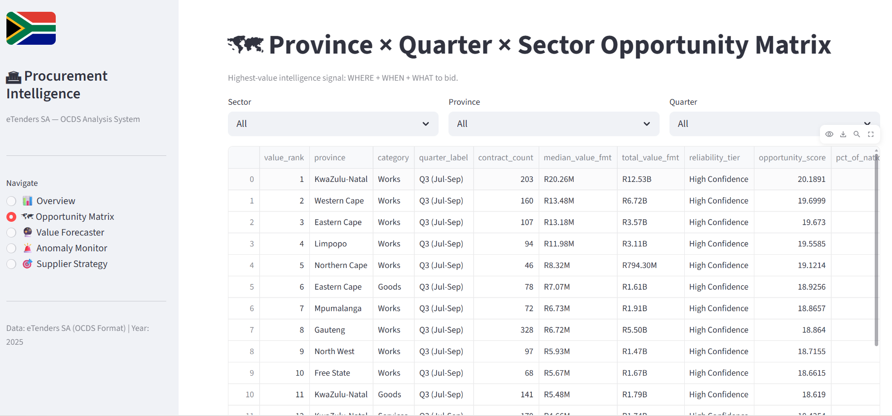
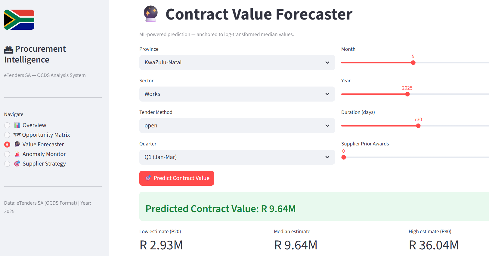
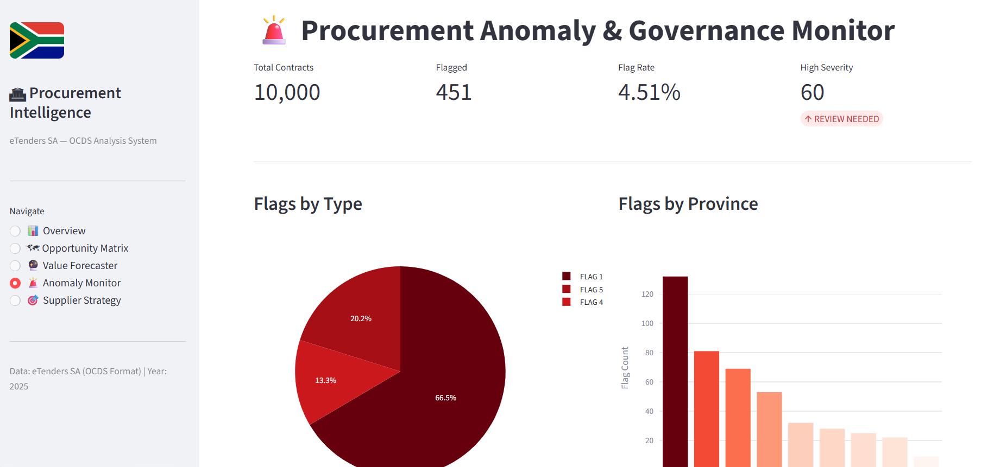
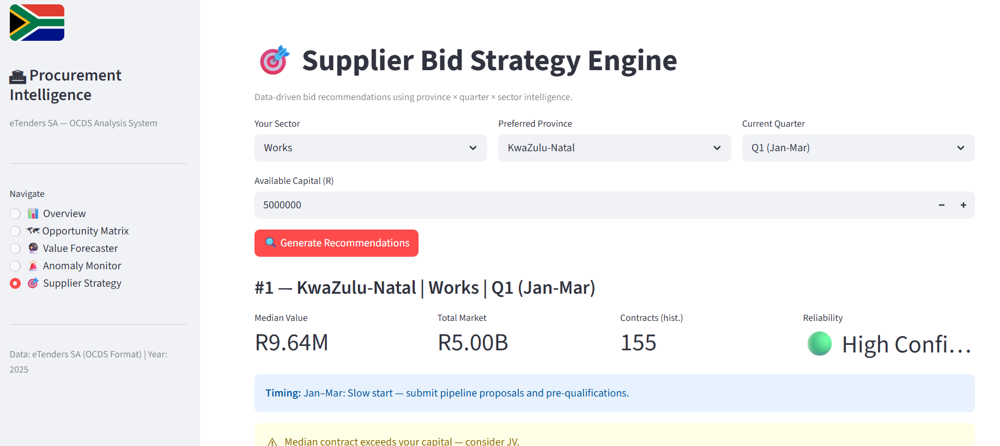

# 🏛 South Africa Public Procurement Intelligence System

> **Transforming public procurement data into strategic intelligence for suppliers, procurement officials, and policy makers.**

A complete **Data Analytics, Machine Learning, and Business Intelligence platform** that analyses South African public procurement data (OCDS standard) to identify market opportunities, forecast contract values, detect procurement anomalies, and support evidence-based procurement decisions.

<p align="center">

[](https://sapublicprocurementintelligencesystem-jfhz7zrt7xscc9hbh2xz9k.streamlit.app/)


</p>

---

# 📊 Business Problem

South Africa publishes thousands of procurement opportunities every year, but the information is highly fragmented and difficult to analyse.

As a result:

- Suppliers struggle to identify profitable bidding opportunities.
- Procurement officials have limited visibility into governance risks.
- Policy analysts lack tools for monitoring spending patterns.
- Contract values are difficult to estimate before bidding.
- Procurement reporting is largely descriptive rather than predictive.

Without analytics, organisations make procurement decisions with incomplete information.

---

# 💡 Solution

I designed and built an end-to-end Procurement Intelligence Platform that transforms raw OCDS procurement data into actionable business intelligence.

The platform combines:

- Business Intelligence
- Machine Learning
- Predictive Analytics
- Opportunity Scoring
- Governance Monitoring
- Interactive Dashboards

to help stakeholders make faster and more informed procurement decisions.

---

# 🎯 Business Objectives

The system enables organisations to answer questions such as:

✔ Which provinces offer the biggest procurement opportunities?

✔ Which sectors have the highest contract values?

✔ What is the expected value of a future tender?

✔ Which contracts require governance review?

✔ Where should suppliers focus their bidding strategy?

✔ How is procurement spending changing over time?

---

# ⚙️ My Approach

## ① Data Engineering

Built a scalable pipeline that:

- Loads procurement data
- Cleans and validates records
- Engineers analytical features
- Generates business-ready datasets

---

## ② Business Intelligence

Created interactive dashboards for:

- Procurement Market Overview
- Opportunity Matrix
- Contract Value Forecasting
- Governance Monitoring
- Supplier Strategy

---

## ③ Machine Learning

Developed predictive models to estimate contract values using historical procurement data.

Models include:

- Random Forest
- XGBoost
- LightGBM
- Ridge Regression
- Ensemble Voting Model

---

## ④ Governance Analytics

Implemented anomaly detection capable of identifying procurement risks including:

- High-value outliers
- Supplier concentration
- Restricted procurement methods
- New supplier awards
- Spending spikes
- Governance red flags

---

## ⑤ Decision Intelligence

Generated recommendation engines that provide:

- Bid recommendations
- Market prioritisation
- Province rankings
- Seasonal opportunity analysis
- Procurement strategy insights

---

# 📈 Dashboard Preview

## 📊 Market Overview

Provides an executive summary of procurement activity across South Africa.

- Total Procurement Spend
- Tender Volume
- Provincial Spending
- Market Seasonality
- Executive KPIs



---

## 🌍 Province × Quarter × Sector Opportunity Matrix

Ranks procurement opportunities using reliability scoring and market intelligence.

Allows suppliers to identify:

- where to bid
- when to bid
- which sector to prioritise



---

## 🔮 Contract Value Forecaster

Machine learning powered forecasting tool that estimates future contract values based on procurement characteristics.

Features:

- Province selection
- Sector selection
- Quarter analysis
- Historical confidence intervals



---

## 🚨 Procurement Governance Monitor

Automatically detects procurement anomalies requiring further investigation.

Highlights:

- High-risk contracts
- Procurement flags
- Provincial anomaly distribution
- Governance monitoring



---

## 🎯 Supplier Strategy Engine

Provides suppliers with evidence-based bidding recommendations using procurement intelligence.

Recommendations include:

- Best province
- Best quarter
- Market size
- Competition
- Capital considerations
- Confidence scoring



---

# 📊 Business Value Delivered

The platform transforms procurement data into strategic intelligence by enabling:

- 📈 Better procurement planning
- 📊 Executive reporting
- 🎯 Smarter supplier bidding
- 🤖 Predictive contract valuation
- 🚨 Governance monitoring
- 💰 Market opportunity discovery
- 📍 Province-level procurement intelligence

---

# 🛠 Technology Stack

### Data Analytics

- Python
- Pandas
- NumPy

### Machine Learning

- Scikit-Learn
- XGBoost
- LightGBM

### Business Intelligence

- Streamlit
- Plotly

### Backend

- FastAPI
- APScheduler

### Database

- MySQL

---

# 🚀 Live Application

## Explore the Dashboard

### 🌐 https://sapublicprocurementintelligencesystem-jfhz7zrt7xscc9hbh2xz9k.streamlit.app/

---

# 📂 Repository Structure

```
procurement_intelligence/
│
├── 00_raw_data/
├── 01_cleaned_data/
├── 01_notebooks/
├── 03_sql_scripts/
├── 04_outputs/
├── 05_documentation/
├── 06_procurement_intelligence/
├── README.md
└── requirements.txt
```

---

# 👨‍💻 About Me

I enjoy building analytics solutions that combine data engineering, machine learning, and business intelligence to solve real organisational challenges.

This project demonstrates my ability to take complex public datasets and transform them into interactive decision-support systems that deliver measurable business value.

---

# 📬 Connect With Me

📧 Email

kalolohlesi@gmail.com

🌐 Portfolio

https://sihle-kalolo-portfolio.vercel.app/

---

⭐ If you found this project useful, consider starring the repository or connecting with me. I'm always interested in opportunities within Data Analytics, Business Intelligence, Data Science, and AI.
